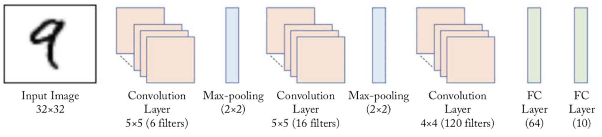

## LeNet Implementation

### LeNet Architecrure
<p>   
</p>
<center>

</center>

image is taken from [source](https://tianhaoo.github.io/2019/05/22/LeNet-5%E8%AF%86%E5%88%AB%E6%89%8B%E5%86%99%E6%95%B0%E5%AD%97/)   
<p>   
</p>
<center>   
   
</center>

image is taken from [source](https://neurohive.io/en/popular-networks/vgg16/)   
<p>   
</p>
### Training on MNIST
<p></p>
<center>

</center>

### Requirement
```
python==3.7.0
numpy==1.18.1
```
### How to use
Training & Prediction can be run as follows:    
`python train.py train`  
`python train.py predict img.png`  

<p>   
</p>
### More information
* Please refer to the original paper of LeNet [here](https://engmrk.com/lenet-5-a-classic-cnn-architecture/) for more information.

### Result for MNIST:   
* Learning rate = 0.001  
* Batch size = 32  
* Optimizer = Adam   
* epochs = 2

Name |  Training Accuracy |  Validation Accuracy  |
:---: | :---: | :---:
LENet | 96.47% | 97.56%
